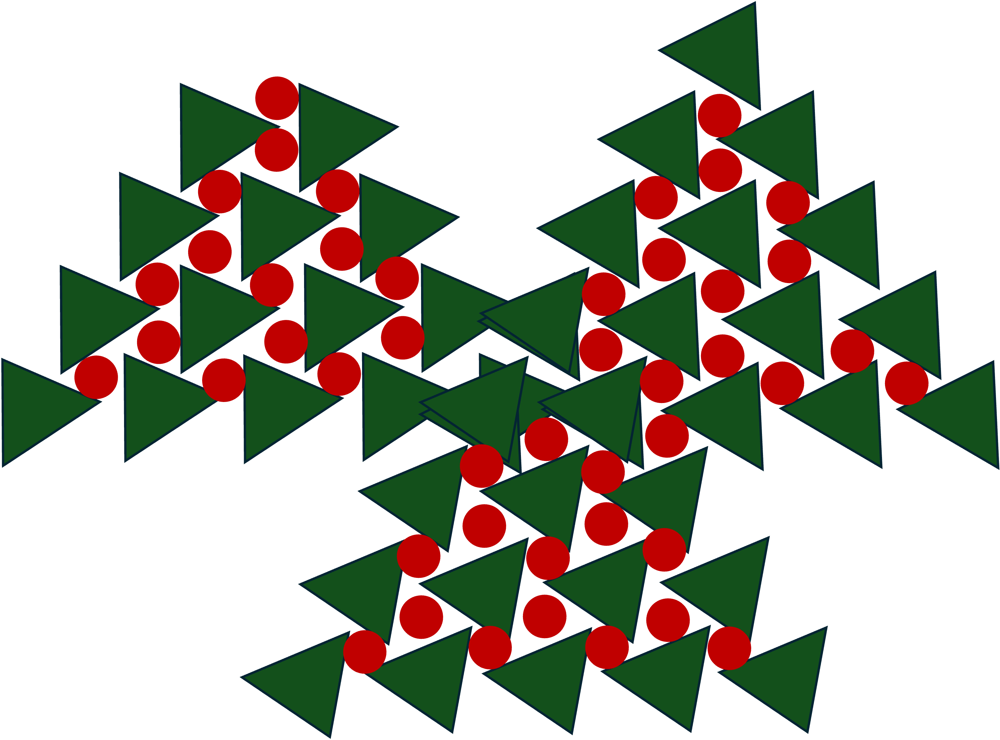

## This is a test

# Header 1 (\#)
**Bold text** (\*\*XXX\*\*)
## Header 2 (\#\#)
*Italic Text*(\*XX\*)
### Header 3 (\#\#\#\)
- Unordered list item 1 (\-)
- unordered list item 2

[link to Google](https://www.google.com/) text use \[\] and link use \(\)


`inline code` 
use \` on both sides for inline code

```
Code blocks
chunck of codes
print ("Hello!")
```
use \`\`\` on both sides for code blocks


>Blockquote text goes here 

\> at the beginning.


---
\-\-\- means horizontal line

with :

|Header A|Header B |
|:---|:---|
|Cell1| Cell 2|

Q1: "|" for table, but do we need \: in front of \-\-\-?

without :

|Header A|Header B |
|---| ---|
|Cell1| Cell 2|

without middle \|\-\-\-\|\-\-\-\|

|Header A|Header B |
|Cell1| Cell 2|


<span style="color:red;">Merry Christmas!</span>
Q2: Do you know how to change color and font in markdown?